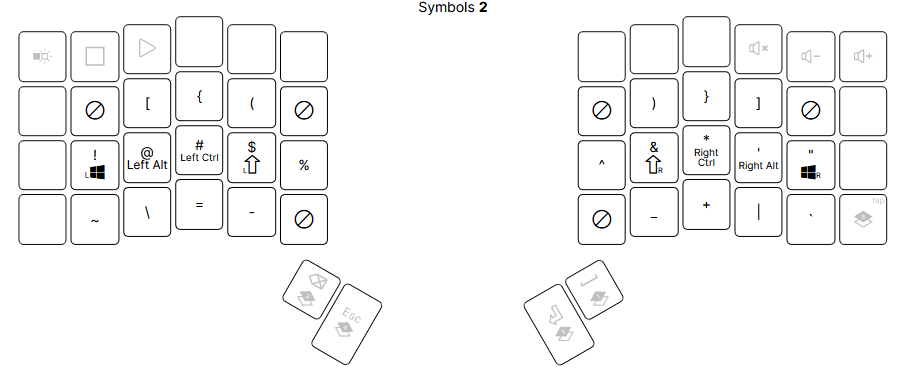
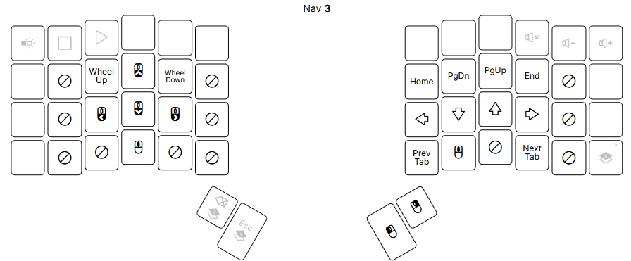
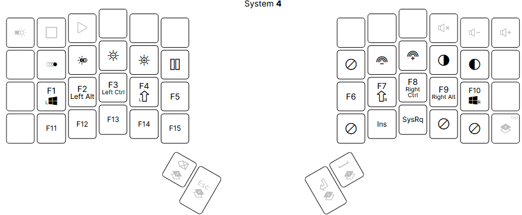

# Purpose

I have to type a lot. This means that I want an efficient keyboard layout that is fun to use. 

# Layout

My keyboard is the [ZSA Voyager](https://www.zsa.io/voyager), which has 52 keys. I try to use the top and far side rows as little as possible for MAXIMUM ERGONOMICS. 

The main layout uses 34 keys, with each layer responsible for one purpose.

## 0. Base Layer

This layer contains all the expected stuff in QWERTY layout. 

- Home row mods on each side, where each finger is assigned a specific modifier (eg. shift on both index fingers).
- Each layer is available by holding down a thumb key (except gaming layer, which uses key on unused row).

### Combos
- F + J => CAPSWORD
- Both inner thumb keys => DELETE
- Both out thumb keys => TAB

## 1. Numbers Layer

All numbers live here, following the same layout as a traditional keyboard, but on the home row. 

## 2. Symbols Layer

- Shifted number symbols on home row, with ' and " taking the remaining spaces.
- Symbols on the bottom row use the same finger for shifted / unshifted version of key on traditional keyboard: `-_`, `+=`, `|\`
- Bracket types all open and close with the same finger. 

## 3. Navigation Layer
 
- Arrow keys are placed in the same position as Vim motions movement. Home/End and PageUp/PageDown have also been placed to match the arrow key placement for less mental overhead.
- Left hand has mouse controls, with click actions on the right hand. 

## 4. System Layer

- Contains function keys on the home row, with F11 and F12 under F1 and F2 respectively. 
- Keyboard lighting controls.
- Remaining misc. keys such as insert.

## 5. Gaming Layer

Changes the keys to be more friendly for playing games. Keys shifted over to keep comfort from column stagger. Most used gaming keys on left side, with quick save / load, screenshot, and volume controls on right side. 

