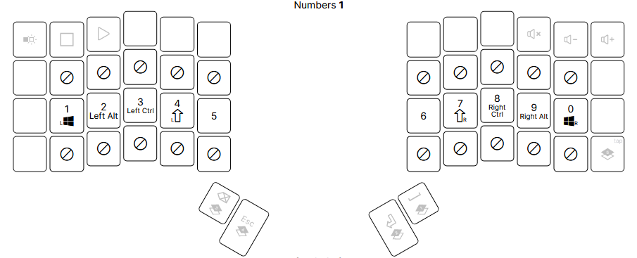

# keyboardLayout

## Purpose

I have to type a lot. This means that I want an efficient keyboard layout that is fun to use. 

## Layout

My keyboard is the [ZSA Voyager](https://www.zsa.io/voyager), which has 52 keys. I try to use the top row as little as possible for MAXIMUM ERGONOMICS.

### 0. Base Layer

This layer contains all the expected stuff in QWERTY layout. There are some small changes such as Esc where CAPS normally is (shoutout VIM users). 

### 1. Numbers / Symbols Layer

All numbers / symbols live here. Symbols such as ! and @ are typed using shifted numbers.

### 2. Navigation / Media Controls Layer

### 3. Gaming Layer

Changes the keys to be more friendly for playing games.

